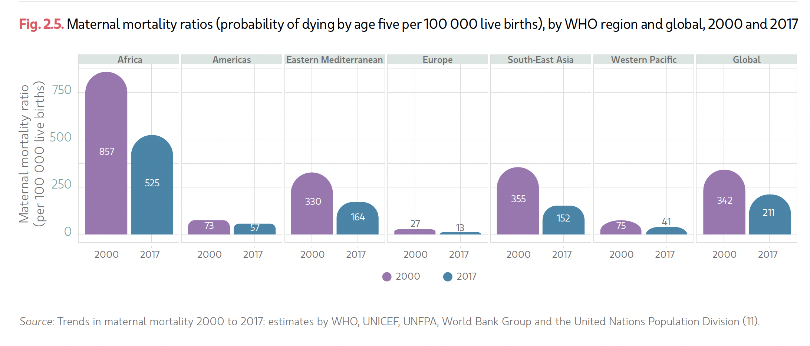

# Critque By Design 

## Introduction
Coming from a developing country which lacks the basic infrastructure, funding, and skillset to provide good quality healthcare to masses especially women, I am always inquisitive to know how successful the initiatives by World Health Organization (WHO) are when it come women’s health. Therefore, I decided to review a data visualization chart for Maternal Mortality Ratio. 


## Maternal Mortality Ratio - A WHO Report Data Visualization 
The visualization below was taken from [WHO Health Statistics 2022 Report](https://www.who.int/publications/i/item/9789240051157) (page 22) and the data was scraped from the corresponding statistics guide – [Trends in Maternal Mortality](https://www.unfpa.org/featured-publication/trends-maternal-mortality-2000-2017) (Annex 7, page 79). 



The target audience for this data visualization is internal WHO stakeholders, policymakers,government agencies, non-governmental organizations, members of public interested and working in the field of Health.

This visualization showcases the maternal mortality ratios for the year 2000 and 2017. I feel that the colors are well controlled in this chart by using two colors to distinguish between years alongside a legend to indicate the correlation between the color scheme and year. Each bar in the graph clearly states the maternal mortality ratio which made it easy to read the chart. The source of data is also mentioned which signals that the data is authentic. Another positive point about this chart is that all countries are placed next to one another alphabetically and horizontally which makes it easy to compare between them.

Interpreting this data visualization in isolation of the qualitative data outlined in the report, one might ponder as to what story does this visualization really aims at narrating. The chart lacks a crisp title which indicates the purpose of the graph. However, after perusing through it closely, the viewer is able to identify that it showcases a decline in maternal mortality ratio in WHO regions and the world. The chart appears heavy due to excessive gridlines, curved bar lines and inconsistent aesthetics (shape of bars and labeling). 


## Brainstorming & Re-iterating Data Visualisation

After interpreting the chart, I placed myself in the shoes of the target audience and tried to recreate a visualization which would easily communicate the message without the need for supplement qualitative information. Therefore, I decided to recreate it the form of a line graph. 
 


I sketched the above graph using the data to showcase the trends over the span of seventeen years. The ideology behind using a line graph was to trace the trend over a period of time rather than at merely just two instances (i.e. in 2000 and 2017). This graph makes it easy for the viewer to decipher the trend at the first glance and understand that maternal mortality is declining. Given I was sketching, I used different colors for every country to distinguish between countries. I added a title to specify what the chart is trying to convey. 

### User Research: Bringing in the external voice

After sketching the visualization, I reached out to two potential users of this data and requested them to critique the data visualization. The interview questions were: 

1.	What is this chart about?
2.	What do you understand from this graph?
3.	Was it easy or difficult for you to interpret this chart?
4.	Who is the target audience for this?
5.	What element(s) do you like/dislike?
6.	Is there anything that surprises or confuses you?
7.	What would you change or do differently?
8.	Do you have any other suggestions?

**Summary of Critique:** 
The chart type is easy to interpret and analyse and allows the reader to understand the trend. However, the chart title needs to be changed as it is very report oriented and does not narrate or emphasize the storyline. The use of color needs to be controlled to avoid distraction and the rainbow effect. There was confused about the Y-axis label- this was something I didnot see coming therefore it was a good insight. 

### Raw Interview Data:
```
Interview #1: 
Name: Student A,
Age: Late 20’s 
```

1.	What is this chart about?
It’s about the maternal mortality rates across the different regions of the world.
2.	What do you understand from this graph?
Africa has been the region with the highest maternal mortality rates, but it has been decreasing through the last 20 years. Also, Africa is the only one above the global average rate. Two other regions have presented a decrease through time, but the remaining 3 have had stable rates.
3.	Was it easy or difficult for you to interpret this chart?
Yes, it’s very specific.
4.	Who is the target audience for this?
People that want to promote social policies to reduce maternal mortality rates, such as governments and NGO organizations.
5.	What element(s) do you like/dislike?
The interviewee dislikes the title, it should be more specific, maybe saying something about those rates. On the other hand, likes that this is a line chart, because it’s easy to understand the trend.
6.	Is there anything that surprises or confuses you?
The rate of the variable of Maternal Mortality. What does it mean per 1000 live births? I would guess that it means that the baby lived, and the mother died, but not sure. It should specify it because one could think it could also include both deaths.
7.	What would you change or do differently?
Maybe the colors, less of a rainbow, or maybe the labels, especially the labels for the 3 regions with the lowest rates, they should be easy to identify.
8.	Do you have any other suggestions?
Maybe to highlight only the regions with the worst trends (or maybe even only one) and compare it to the global average.

```
Interview #2: 
Name: Student K
Age: Mid 20’s 
```

1.	What is this chart about?
It shows the maternal mortality for WHO regions.
2.	What do you understand from this graph?
It shows that the maternal mortality has gone down in recent years especially in Africa.
3.	Was it easy or difficult for you to interpret this chart?
It was easy to understand.
4.	Who is the target audience for this?
This relevant for people in the public sector, WHO stakeholders and NGOs. Maybe students too!
5.	What element(s) do you like/dislike?
Dislike: The sketch makes it difficult to interpret due to lack of accuracy especially for the lines near the X-axis. 
Like: It is a line graph hence easy to read the graph
6.	Is there anything that surprises or confuses you?
none. 
7.	What would you change or do differently?
I would draw it digitally and use less colors.
8.	Do you have any other suggestions?
Be a little more specific with the title. 

```
I also carried out a third critique in a focus group setting which consisted of three students enrolled in a master’s program.
```
The critique was as follows: 

1.	What worked?
The use of line chart to show data, Global has been included as a benchmark measure, the highest decline can easily be spotted, and the labels/ticks are placed accurately. 
2.	What didn’t work?
The scale for the year jumps from 5 year gap to a 2 year gap towards the end, title is report oriented and needs to be a little descriptive, rainbow colors are distracting, global line should be a different color. 
3.	What questions came up?
What does the y-axis label mean, why is Africa’s data skewed, and is there anything you are trying to highlight or emphasize through this chart.
4.	What new inspirations arose?
This could be maybe shown on a map and title should narrate the story. 


<div class="flourish-embed flourish-chart" data-src="visualisation/12680538"><script src="https://public.flourish.studio/resources/embed.js"></script></div>

