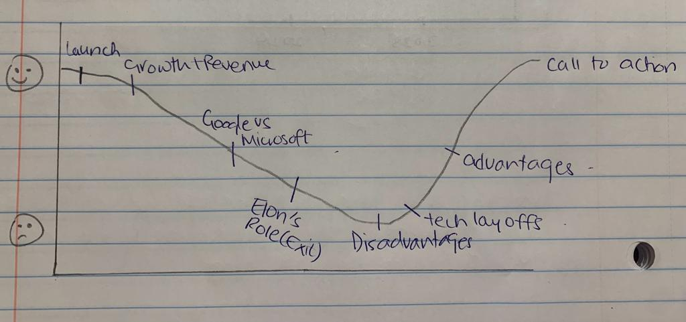
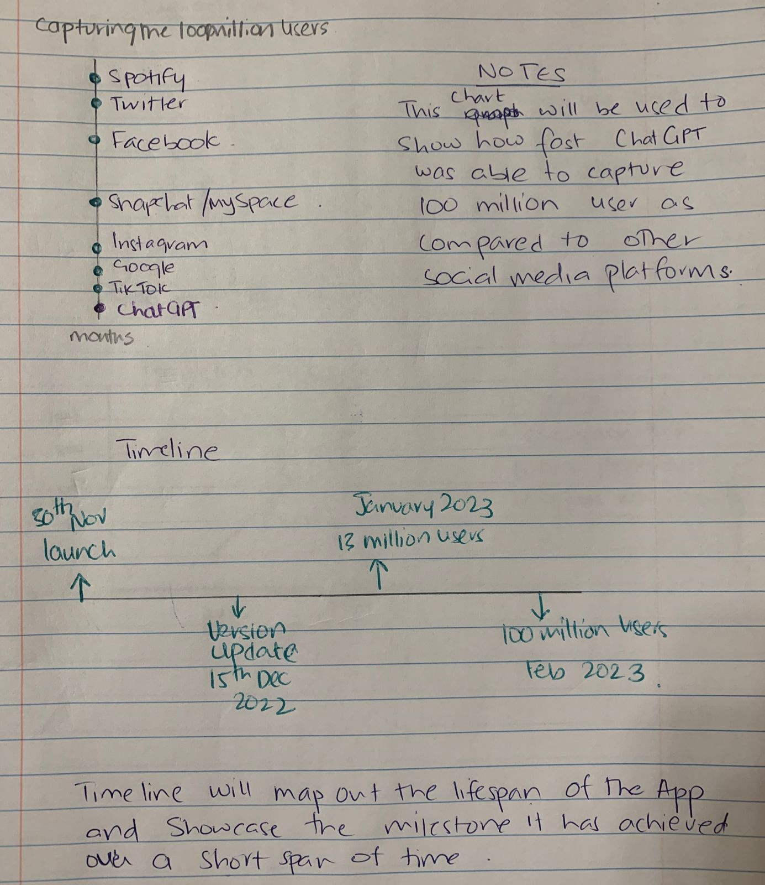
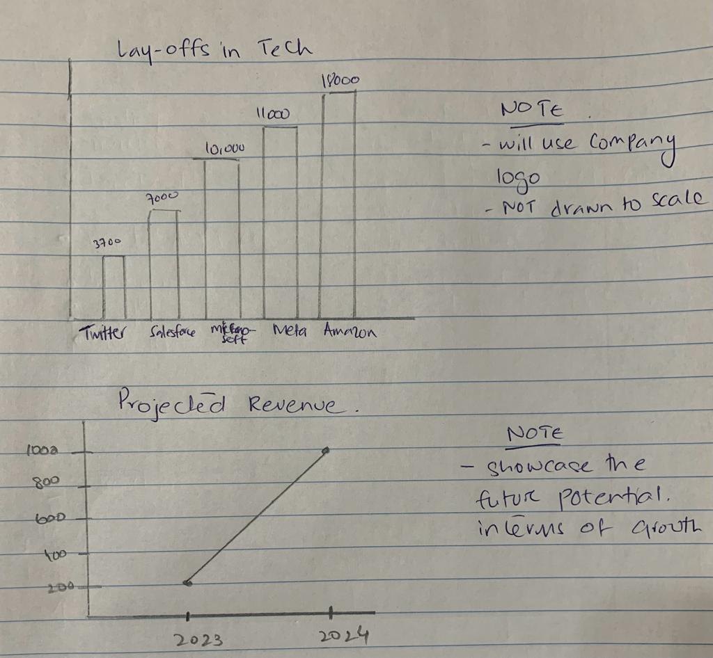

| [Telling-Stories-with-Data](https://nahalg.github.io/Telling-Stories-with-Data/) | [Visualizing Government Debt](https://nahalg.github.io/Telling-Stories-with-Data/Visualisinggovernmentdebt.html) | [Critique by Design](CritiqueByDesign) | [Final Project I](FinalProjectpart1) | [Final Project II](https://nahalg.github.io/Telling-Stories-with-Data/Finalprojectpart2.html)|[Final Project III](https://nahalg.github.io/Telling-Stories-with-Data/Finalprojectpart3.html)|

# Topic: The Human Race Against ChatGPT

## Outline

The recent innovation in AI – ChatGPT, has shook the world. The capabilities of this AI Chatbot has transformed how we brainstorm ideas and the speed at which are able to create content.  While at one end of the spectrum these breakthroughs are taking place, on the other end of the spectrum there are massive layoffs in the Tech sector. That being said, as final year masters’ students, in-search of jobs amidst a recession, we grapple with the thought that whether the workplace will require our services or will we be outdone by AI and robots. 

Given my interest in the Tech sector, I have been really interested in how ChatGPT came into being, who are the masterminds behind it, what are its capabilities and how is it likely going to shape the future of the next generation especially in the education sector.

As I work on this piece, I want to 

-	Map the important milestones from the launch of ChatGPT till today on a timeline to give a brief overview of its lifespan. 
-	Explore its capabilities – this could be through a demo using the chatbot itself and recording the response
-	Map its 100 million growths against that of other social media platforms 
-	Identify the top 6 tech layoffs and see if there is likely a correlation between the innovation and layoffs 
-	Use a world map to showcase the countries where ChatGPT does not exist 
-	Project the expected revenue growth for the year 2023 and 2024
-	Discuss the potential advantages and disadvantages of ChatGPT in the field of the education
-	Bring in the consumers voice through primary research
-	Call to action: Do we adapt our ways of life to the use of ChatGPT or wage a war against it?

The below image showcases the storyline for the pitch:

## Initial sketches

The below images are rudimentary sketches for the storyline. 

I also plan to use a map to highlight the regions where ChatGPT is not available. 

## The data

Given this is an upcoming topic, I have not been able to find compiled data sets yet have found websites and articles which have the data stored in the storyline. I have scraped off data from different online resources and built in my database on excel. The excel document has been stored on Google and is [linked here](https://docs.google.com/spreadsheets/d/16v_M89IappL7Qbsz3k_EmXBSWl9tdxUB/edit?usp=sharing&ouid=113936660666443927277&rtpof=true&sd=true).

The data will be used to develop graphs, charts, timelines and bolster the storyline I am trying to pitch to the audience. 

Some of the data sources are: 

1.[CNBC](https://www.cnbc.com/2023/01/18/tech-layoffs-microsoft-amazon-meta-others-have-cut-more-than-60000.html)

2.[Demand Sage]( https://www.demandsage.com/chatgpt-statistics/)

3.[Business of Apps]( https://www.businessofapps.com/data/chatgpt-statistics/)

## The Method & Medium 

I will be using Shorthand, flourish, and Tableau to develop the narrative which can easily be presented to audiences whilst maintaining the interactive feature of the graphs/charts. I plan to seek the help of ChatGPT and Dall-E to develop content (more so will try to screen-record the use of these software and embed them in the pitch to reiterate the point). I will also use images from google to enhance the aesthetics of the presentation. 
